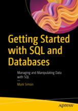
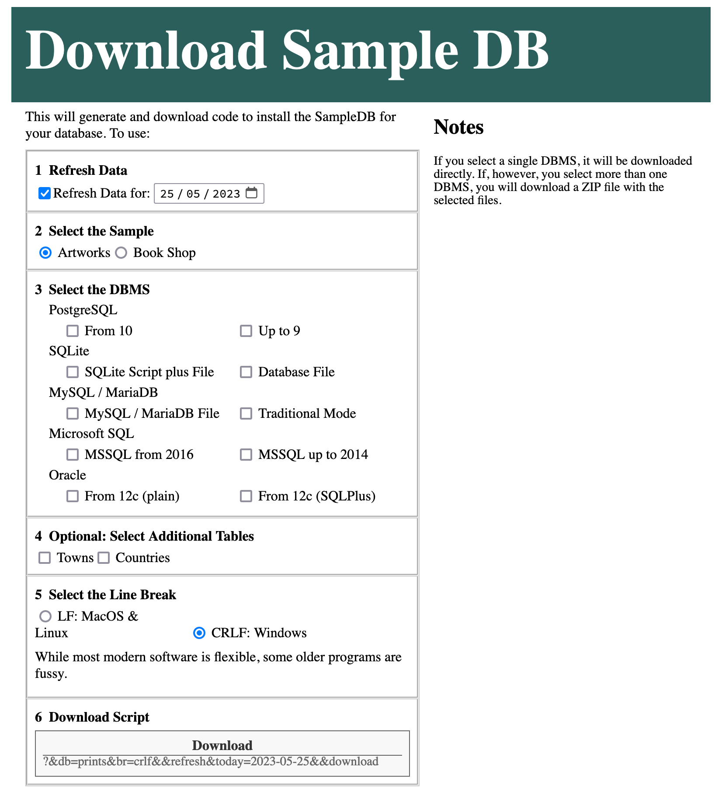

#	Getting Started with SQL and Databases

This is support repository for [*Getting Started with SQL and Databases*](https://link.springer.com/book/10.1007/978-1-4842-9493-2) by Mark Simon (Apress, 2023).

[comment]: #cover

Release v1.0 corresponds to the code in the published book, without corrections or updates.

-	[Downloading the Sample Database](#sample-database)
-	[The Exercise Files](#exercise-files)

##	Sample Database

If you want to follow along with the samples, you should install the sample database. You can get a script file in one of three ways:

-	[Download one of the static script files](#static-script-files)

	This is a collection of sample script files stored here.

-	[Download one of the dynamic script files](#dynamic-script-files)

	This will generate random sample data to make the sample a little more unpredictable.

-	[Visit the Sample Database site](#sample-database-site)

	Here you can choose more options to generate one or more sample database scripts.
	
All three methods will give you essentially the same database. The difference will be in whether the actual data varies.

###	Using the Scripts

1.	Using your Database Client, create a new database. Call it something like __artworks__.

2.	Open and run the downloaded script file for your new database.

###	Static Script Files

The simplest way to get the database is to get one of the following for your DBMS:

-	[PostgreSQL](https://github.com/Apress/getting-started-sql-databases/blob/master/static-scripts/prints-pgsql-10-script.sql)
-	[SQLite](https://github.com/Apress/getting-started-sql-databases/blob/master/static-scripts/prints-sqlite-script-script.sql)
-	[MySQL/MariaDB](https://github.com/Apress/getting-started-sql-databases/blob/master/static-scripts/prints-mysql-mariadb-ansi-script.sql)
-	[Microsoft SQL](https://github.com/Apress/getting-started-sql-databases/blob/master/static-scripts/prints-mssql-16-script.sql)
-	Oracle
	-	[Oracle (Plain)](https://github.com/Apress/getting-started-sql-databases/blob/master/static-scripts/prints-oracle-12-script.sql)
	-	[Oracle (SQL Plus)](https://github.com/Apress/getting-started-sql-databases/blob/master/static-scripts/prints-oracle-12-plus-script.sql)

If you’re feeling a bit more adventurous, and you want your data to be less predictable, you can use a Dynamic Script File instead.

###	Dynamic Script Files

The following links will generate database script files similar to the static script files above.

The difference is that the dynamic scripts will have different content every time you download.

-	[PostgreSQL](https://sampledb.webcraft101.com/?dbmss[]=pgsql-10&db=prints&br=crlf&refresh&download)
-	[SQLite](https://sampledb.webcraft101.com/?dbmss[]=sqlite-script&db=prints&br=crlf&refresh&download)
-	[MySQL/MariaDB](https://sampledb.webcraft101.com/?dbmss[]=mysql-ansi&db=prints&br=crlf&refresh&download)
-	[Microsoft SQL](https://sampledb.webcraft101.com/?dbmss[]=mssql-16&db=prints&br=crlf&refresh&download)
-	Oracle
	-	[Oracle (Plain)](https://sampledb.webcraft101.com/?dbmss[]=oracle-12&db=prints&br=crlf&refresh&download)
	-	[Oracle (SQL Plus)](https://sampledb.webcraft101.com/?dbmss[]=oracle-12-plus&db=prints&br=crlf&refresh&download)

This will download a freshly randomised script for current versions of you preferred DBMS.

If you want to download more than one script, or you want to vary the options, read the next section.

###	Sample Database Site

[https://www.sample-db.net/](https://www.sample-db.net/)

The full download page looks like this:

This will download a script to generate the sample database. The sample is re-generated every time with random values.

Choose the following options:

1.	Choose a refresh date. The sample sales data will be calculated up to this date.

	You can leave this at the default.
	
2.	Select the Sample Database

	For this book the sample es expected to be __Artworks__.
	
3.	Select the DBMS

	You can choose more than one if you like.
	
	For Oracle, there are some quirks in the script which may not be understood by your particular client. You can try both scripts and see which one doesn’t have any errors.
	
4.	(This book doesn’t require these additional tables)

5.	Select the Line Break

	If you’re doing this on macOS or Linux, the standard line break is the __LF__ character. On Windows, you use the __CRLF__ combination. It probably doesn’t matter in most clients.
	
6.	Click on the generated __Download__ link.

	If you select a single database script, it will be downloaded as a single file with the `.sql` extension. If you choose more than one database file, they will be packaged in Zip file.

##	Exercise Files

The SQL samples in the text are there for you try on your database client. They have also been gathered in single sql files for your convenience:

-	[PostgreSQL](https://github.com/Apress/getting-started-sql-databases/blob/master/exercise-files/postgresql.sql)
-	[SQLite](https://github.com/Apress/getting-started-sql-databases/blob/master/exercise-files/sqlite.sql)
-	[MySQL/MariaDB](https://github.com/Apress/getting-started-sql-databases/blob/master/exercise-files/mysql-mariadb.sql)
-	[Microsoft SQL](https://github.com/Apress/getting-started-sql-databases/blob/master/exercise-files/mssql.sql)
-	[Oracle](https://github.com/Apress/getting-started-sql-databases/blob/master/exercise-files/oracle.sql)




